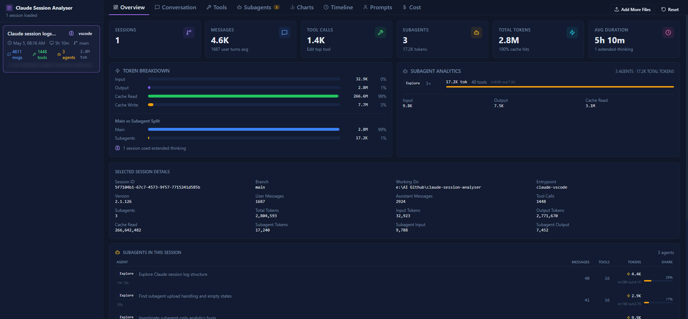
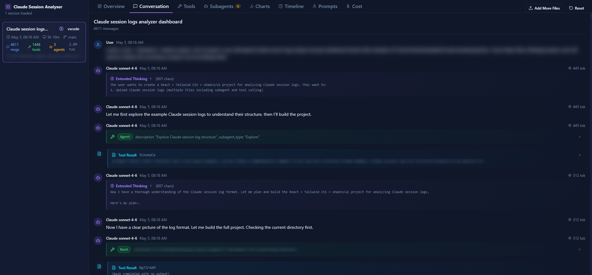
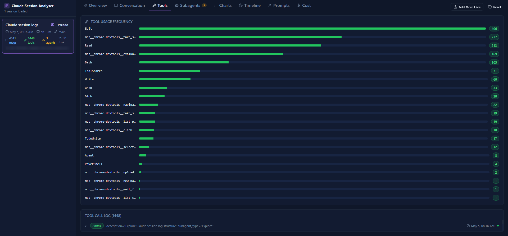
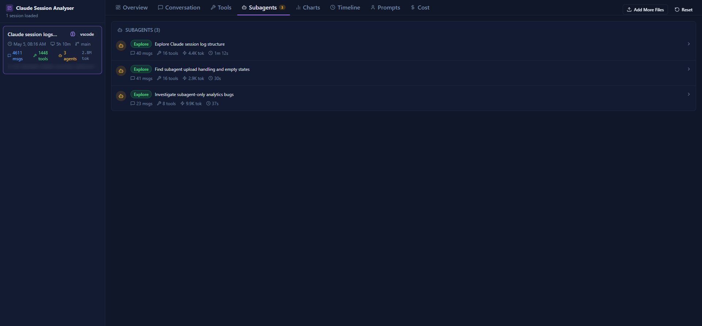
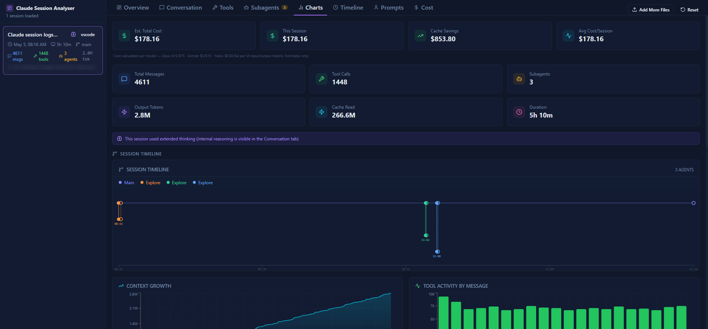
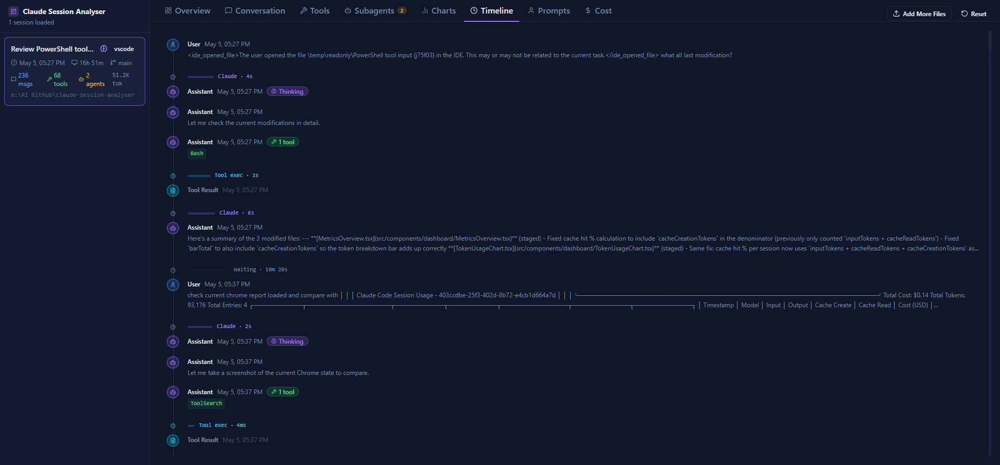
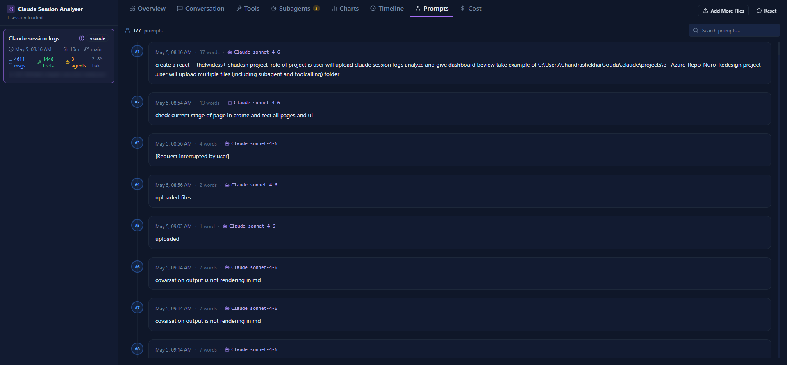
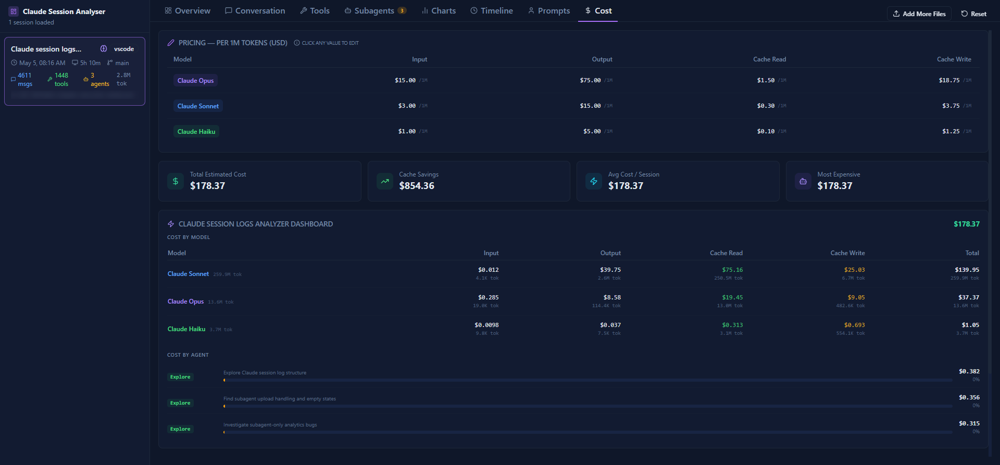

# Claude Session Analyser

A free, browser-based dashboard for exploring Claude Code session logs. Drop in your `.jsonl` files to inspect conversations, tool calls, subagents, token usage, and costs — all processed locally, nothing uploaded.

**Live:** [claude-session-analyser.pages.dev](https://claude-session-analyser.pages.dev/)

> 100% private — nothing leaves your browser. All parsing runs locally via JavaScript. Works fully offline after the initial page load.

---

## Getting Started

### 1. Find Your Session Logs

Claude Code writes session logs to a per-project folder based on your working directory:

| OS | Path |
| --- | --- |
| Windows | `%USERPROFILE%\.claude\projects\<project-slug>\` |
| macOS / Linux | `~/.claude/projects/<project-slug>/` |

Each `.jsonl` file is named by its session UUID. Subagent files are prefixed `agent-`.

### 2. Load Files

Go to [claude-session-analyser.pages.dev](https://claude-session-analyser.pages.dev/), then either:

- **Drag and drop** one or more `.jsonl` files onto the upload area
- Click **Select Files** to pick individual files
- Click **Select Folder** to load an entire project folder at once (fastest)

### 3. Explore

The left sidebar lists every loaded session. Click one to open it, then use the tabs to explore different views.

---

## Features

### Overview

At-a-glance stats for the selected session: message count, tool calls, subagents spawned, total tokens, cache hit rate, and average session duration.



---

### Conversation

Full chat thread with thinking blocks expanded inline. Tool calls show their inputs and outputs directly inside the message. Each assistant message displays an `input + output` token badge — hover it to see the full per-turn breakdown: input, output, cache read, and cache write tokens separately.



---

### Tools

Bar chart of tool call frequency and a full table of every call in the session. Each row shows the tool name, input arguments (JSON), output, and duration.



---

### Subagents

Lists every subagent Claude spawned during the session, with message counts, tool usage, and token totals per agent. Load the subagent `.jsonl` files alongside the main session for full detail.



---

### Charts

Visual token breakdown — input, output, cache read, and cache write — as bar and pie charts. Also shows cache hit rate per session and output/input ratio trends.



---

### Timeline

Chronological list of every message and tool call with timestamps. Between each pair of entries a **gap indicator** shows exactly where time was spent:

- **Claude** (violet) — time Claude spent generating the response, including thinking
- **Tool exec** (cyan) — time the tool took to run; Claude was idle
- **Waiting** (muted) — time before the next user message

Hover any dot to see a rich tooltip: model name, token counts (input/output/cache read/cache write), thinking flag, tool names called, and message preview. Hover a gap indicator to see exact from/to timestamps and duration.



---

### Prompts

Extracted user prompts only — system context injections and tool results stripped out. Useful for reviewing what you actually asked across a long session.



---

### Cost

Estimated cost per session and per model, calculated from token counts using current Claude pricing. Breaks down spend across input, output, cache reads, and cache writes.



---

## Token Counting

### Token Types

| Token Type | Anthropic Field | Billed At | What It Means |
| --- | --- | --- | --- |
| Input | `input_tokens` | 100% | New tokens Claude read this turn |
| Output | `output_tokens` | 100% | Tokens Claude generated |
| Cache Read | `cache_read_input_tokens` | ~10% | Tokens served from prompt cache |
| Cache Write | `cache_creation_input_tokens` | ~125% | Tokens written into the prompt cache |

### Streaming Deduplication

Claude Code's streaming API writes **multiple JSONL rows per assistant message** — one per content block — each carrying the same cumulative token counts. Naively summing all rows overcounts by a factor equal to the number of content blocks.

The analyser deduplicates by keeping only the last row per Anthropic message ID, so each message is counted exactly once:

```text
Raw JSONL (3 rows for one streamed message):
  { id: "msg_abc", input: 3, output: 238, cache_read: 14126, cache_write: 8449 }
  { id: "msg_abc", input: 3, output: 238, cache_read: 14126, cache_write: 8449 }
  { id: "msg_abc", input: 3, output: 238, cache_read: 14126, cache_write: 8449 }

After dedup (1 unique message):
  { id: "msg_abc", input: 3, output: 238, cache_read: 14126, cache_write: 8449 }

Without dedup:  22,816 tokens counted  ✗
With dedup:      7,605 tokens counted  ✓
```

### Cache Hit Rate Formula

```text
cacheHitPct = cacheReadTokens / (inputTokens + cacheReadTokens + cacheCreationTokens)
```

Cache creation tokens are included in the denominator because they are processed on the input side even when being written to cache.

---

## Tips

- **Load the main session + all subagent logs together** for accurate cross-agent token totals and the full call tree
- **Select Folder** is the fastest way to load everything — point it at the project folder
- **Add More Files** (top-right) lets you add logs without clearing what's already open
- **Reset** (top-right) clears all loaded sessions and returns to the upload screen

---

## Local Development

```bash
git clone https://github.com/your-username/claude-session-analyser
cd claude-session-analyser
npm install
npm run dev       # http://localhost:5173
npm run build     # production build → dist/
```

---

## Contributing

1. Fork the repo
2. `npm install && npm run dev`
3. Make your changes
4. `npm run lint && npm run build`
5. Open a PR against `main`

---

## License

MIT — free to use, fork, and self-host.

---

Built by [Chandrashekhar Gouda](https://www.linkedin.com/in/chandrashekhar-gouda/) · Open source · Hosted on [Cloudflare Pages](https://pages.cloudflare.com/)
